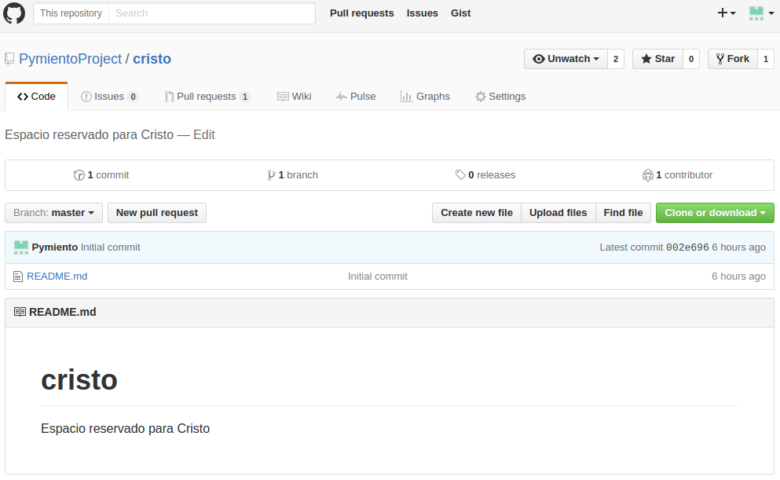
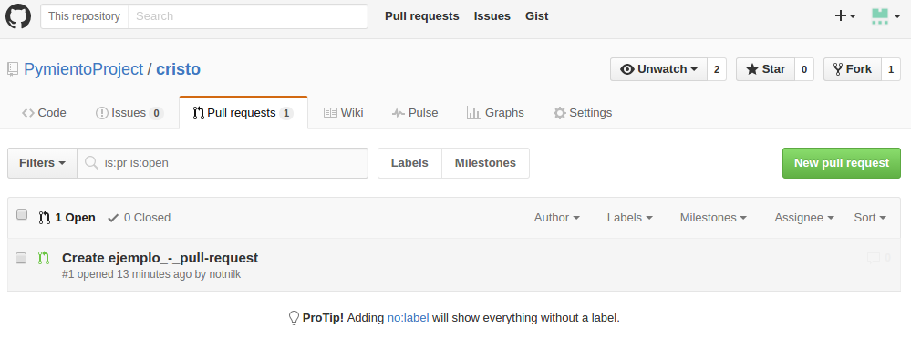
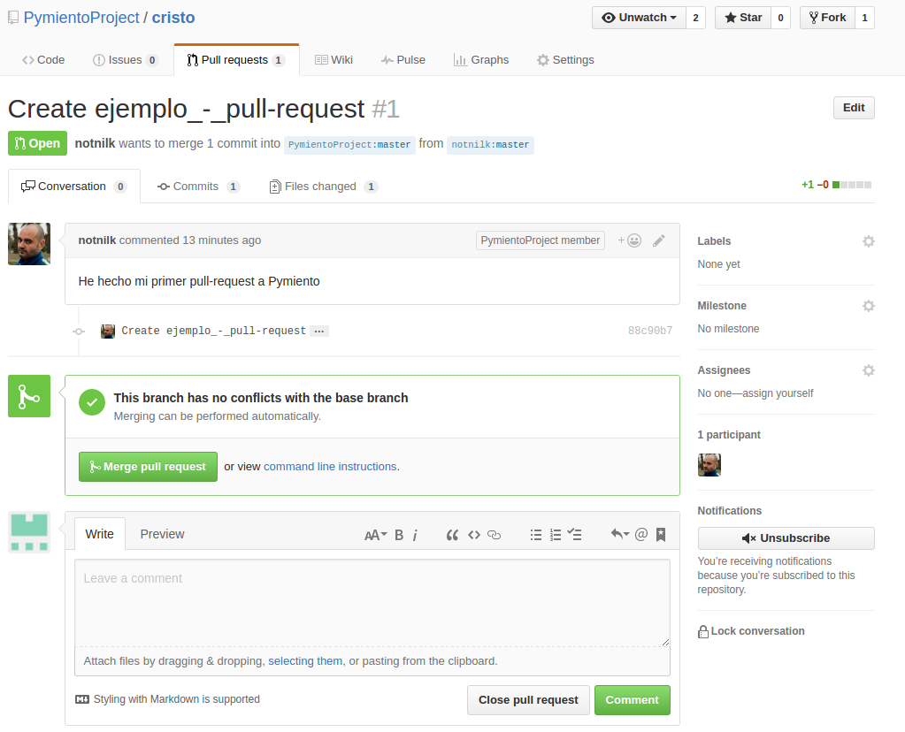
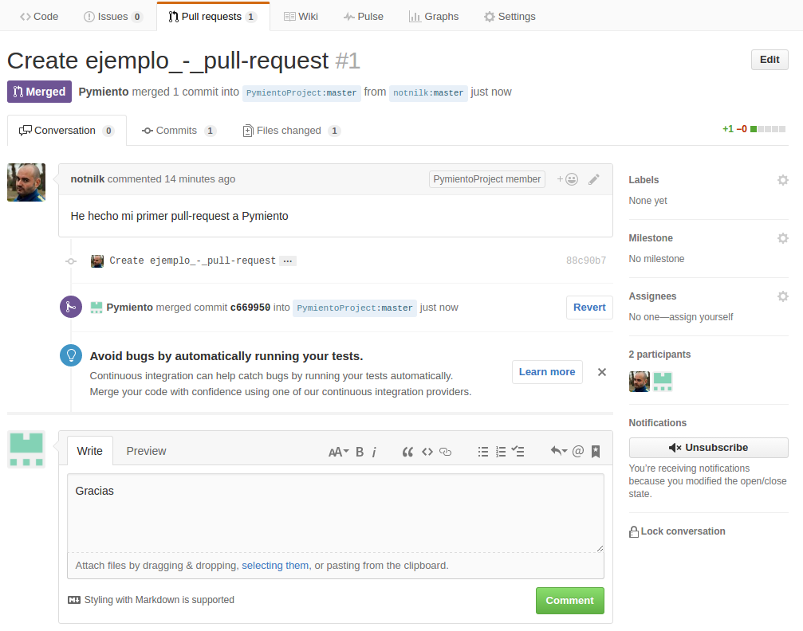
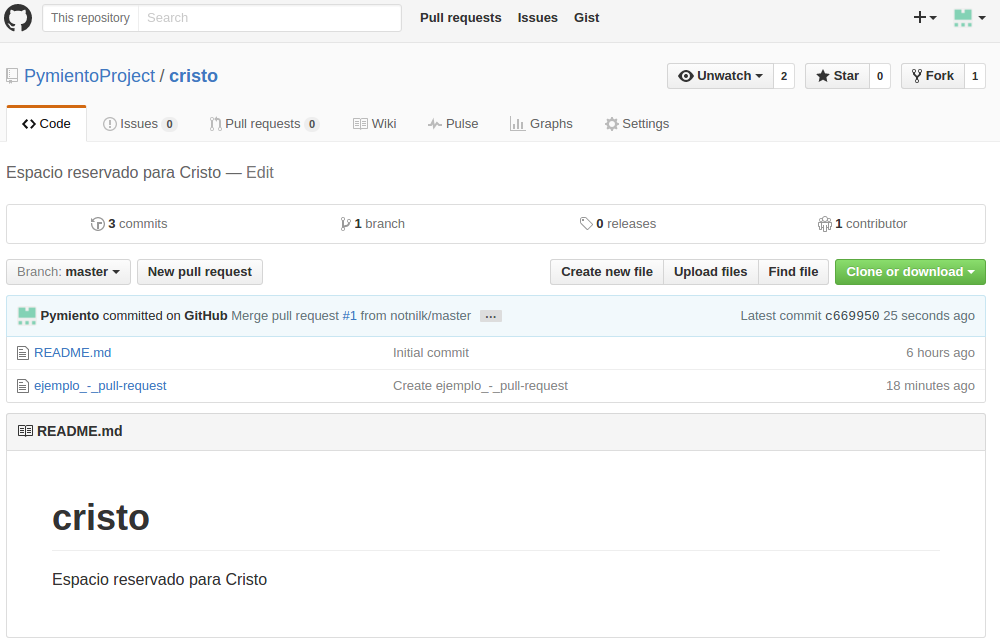

# Aceptar cambios

Supongamos que alguien ha forkeado un repositorio nuestro, por ejemplo un compañero nuestro para ayudarnos con nuestro código. Si nos hace un pull request, este aparecerá en la pestaña _"Pull requests"_ de nuestro repositorio. Seguimos el ejemplo con el _pull request_ anterior del repositorio _cristo_.

Al darle a la pestaña podemos ver que alguien ha solicitado modificar nuestro repositorio.

Si clicamos sobre el _pull request_ abierto podemos ver toda la información de este. Mediante el botón _"Merge pull request"_ podemos confirmar los nuevos cambios.

Una vez hayamos confirmado o no los cambios, podremos mandar un mensaje para notificar esto.

Si lo hemos aceptado, ahora podemos ver como nuestro repositorio original ha sido modificado.

