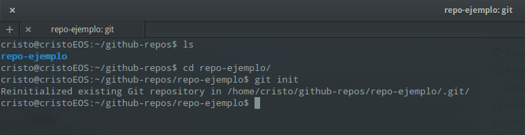
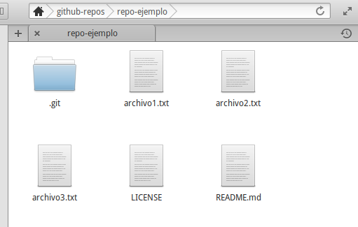
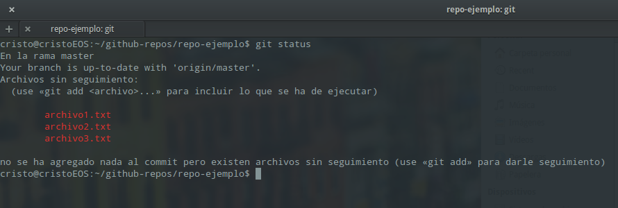

# Trabajar con el repositorio local


Aunque tengamos la carpeta en local con la que podemos añadirle / quitarle cosas, para trabajar con ella como repositorio seguiremos usando la terminal con el comando _git_. Así que hay que diferenciar entre dos conceptos, _repositorio_ y _carpeta_ (aunque visualmente es lo mismo):

- La carpeta para nosotros va a ser la propia carpeta esa que tenemos generada y con la que vamos a trabajar normal y corriente.
- El repositorio es esa misma carpeta, pero que la trataremos a través de _git_ para hacerle otras operaciones. La carpeta _.git_ es la que tiene toda la información del repositorio, así que es recomendable no tocarla.

El primer paso es inicializar el repositorio, para git pueda saber que hacemos dentro de la carpeta. Para ello abrimos la terminal, nos vamos a nuestra carpeta con el comando _"cd nombre_carpeta"_ y ejecutamos luego el comando _"git init"_

```
cd repo-ejemplo
git init
```



Ya está el repositorio preparado para modificarlo. Supongamos que ahora ya le hemos añadido a nuestra carpeta los archivos que necesitamos para trabajar. En mi caso voy a tener 3 archivos .txt, pero podría ser por ejemplo una carpeta con un proyecto de Processing.



Ahora los voy a añadir al repositorio, para ello me tengo que apoyar el en comando _"git add algo"_ ¿Y que es ese _algo_? Pues puede ser el nombre del fichero que quiero añadir. Pero como Git lo han hecho personas muy listas, existe un comando para añadir todos nuestros archivos nuevos y modificados de un golpe. Pero antes de eso vamos a comprobar como git ha detectado que hay ficheros nuevos y/o modificados mediante
```
git status
```



Con ese comando se comprueba como git sabe que hemos modificado algo en la carpeta y que podemos añadir al repositorio. Así que ahora podemos añadir los archivos uno a uno al repositorio con
```
git add archivo1.txt
git add archivo2.txt
git add archivo3.txt
```
O podemos añadir todo de una vez con el comando

```git add .```

Pero todavía no hemos acabado, ahora hace falta subir los archivos al repositorio local. Un ejemplo fácil para que esto se entienda es:

- Imaginemos que hemos alquilado un coche de rent-a-car, le hemos hecho de todo y ahora vamos a devolverlo.
- Con el _git add ..._ lo que hemos hecho es aparcarlo en el recinto de la compañía de renting, pero no les hemos dado las llaves.
- Para entregarles las llaves y acabar todo el trámite usaremos el commando _git commit algo_

Para subir los cambios al repositorio 