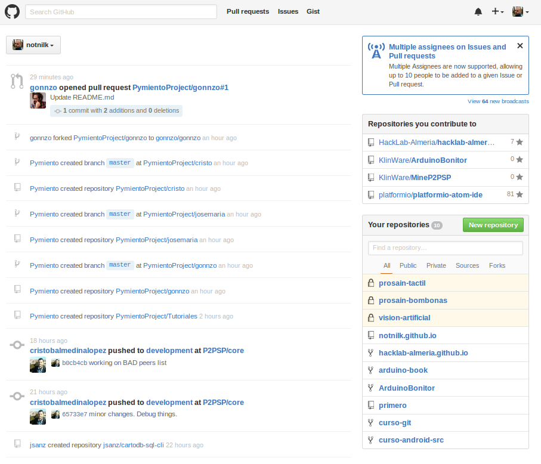
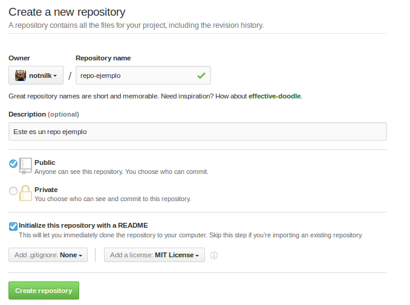
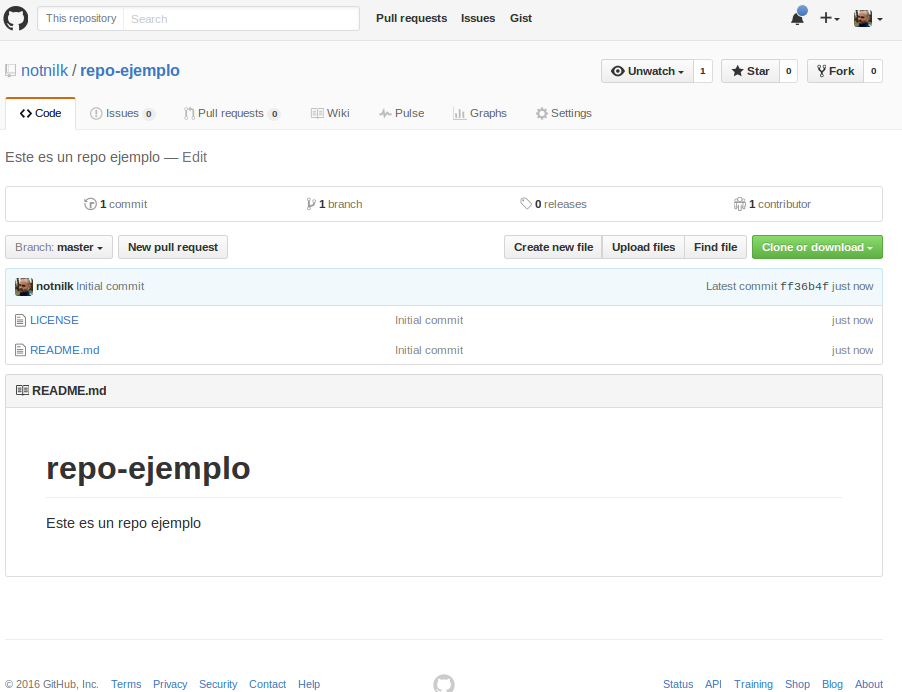

# Crear reposirotio en Github

En nuestro menu principal de Github, le damos al botón verde que pone _"New Repository"_ 

Se nos abrirá la siguiente pantalla donde tendremos que indicar:

- Nombre del repositorio.
- Descripción del repositorio (muy recomendable ponerla).
- Elegir si el repositorio es público / privado.
- Check para inicializar un README.MD (recomendable marcarlo).
- Opciones para el .gitignore (obviarlo ahora).
- Licencia del repositorio (ahora mismo da igual, pero es muy importante).

Y le damos a _"Create repository"_

Y ahora tendremos nuestro repositorio creado y de esta guisa

