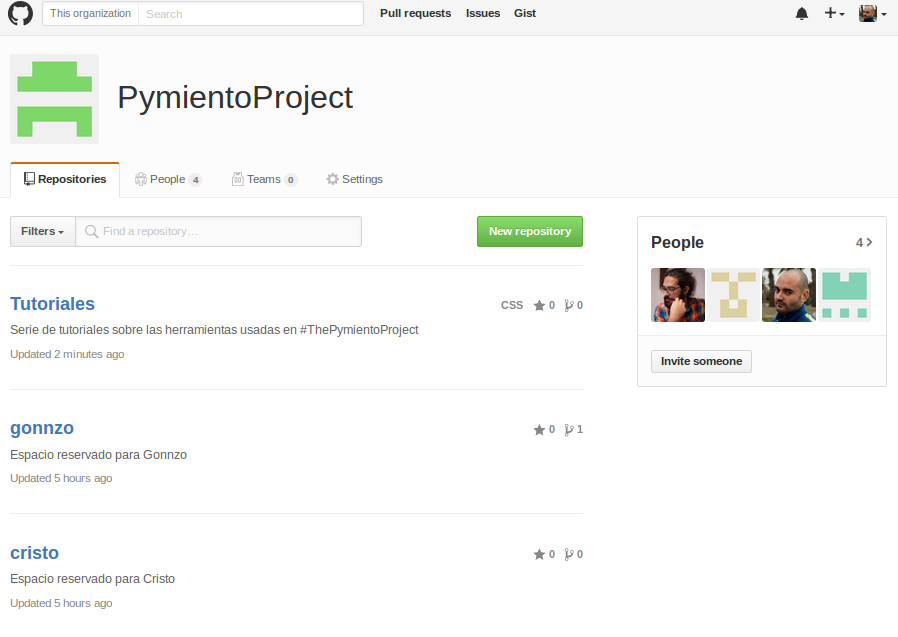
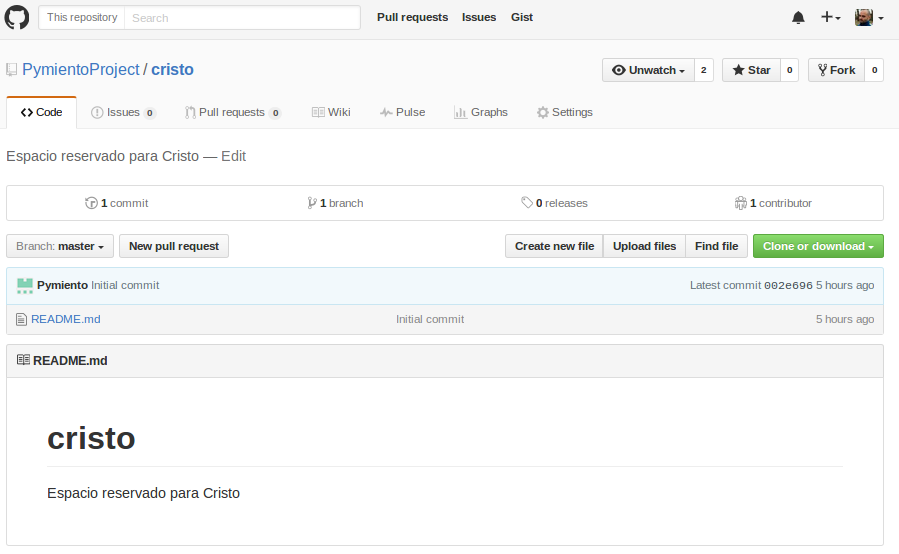
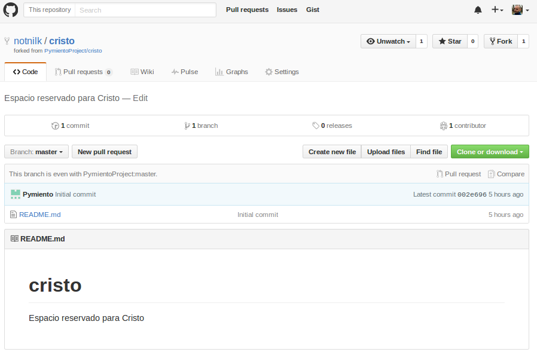

# Fork - Copiar un repositorio

Supongamos que queremos modificar un repositorio de otra persona. Para este ejemplo vamos a usar el repositorio _cristo_ de la organización _Pymiento Project_ 

Si abro el repositorio puedo comprobar como hay un botón arriba a la derecha que pone _Fork_. 

Al pincharle podemos comprobar como nos un repositorio copia en nuestra cuenta

