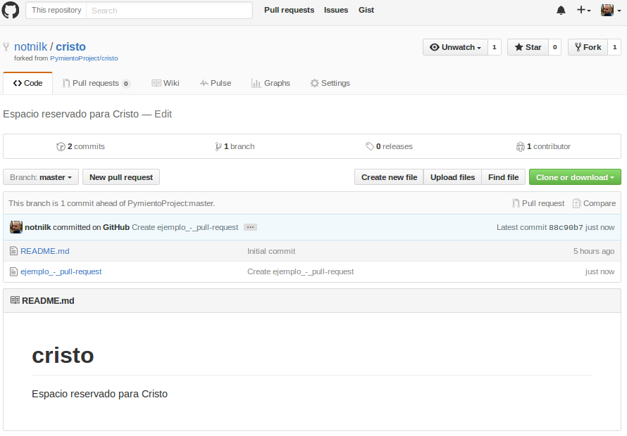
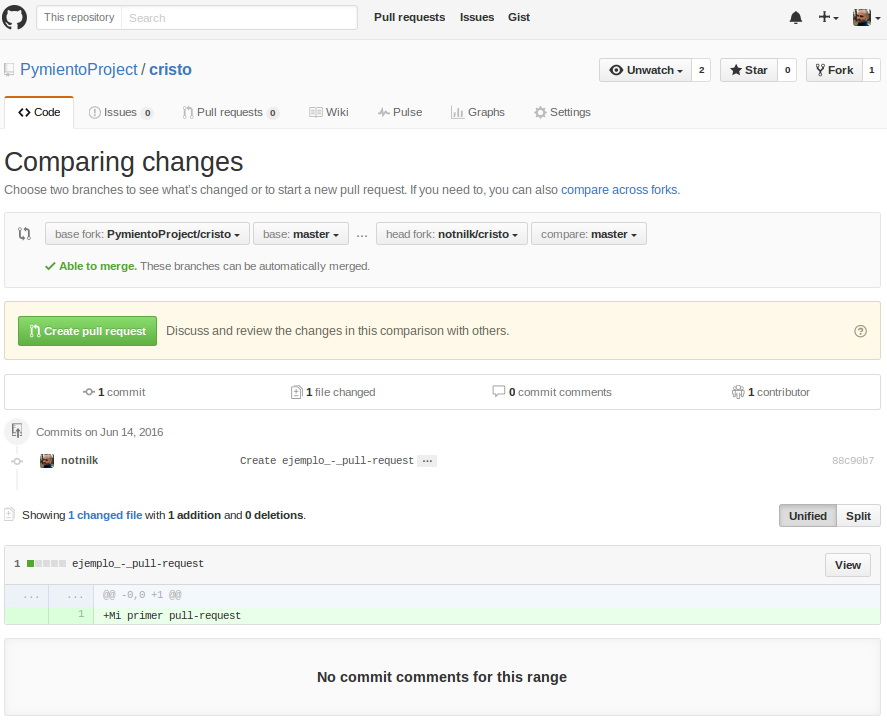
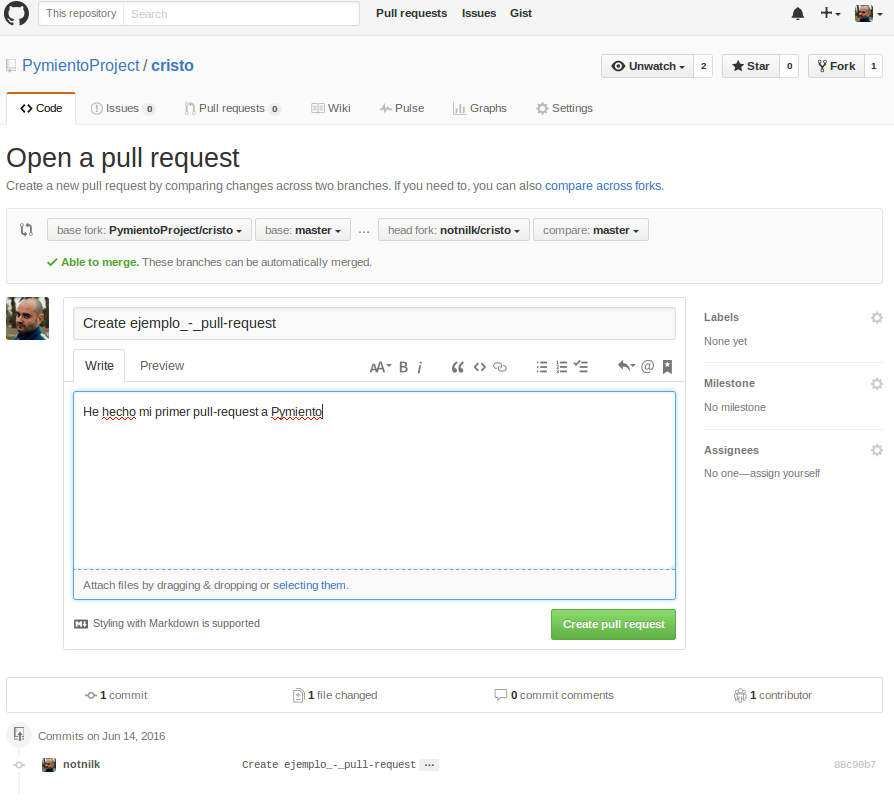
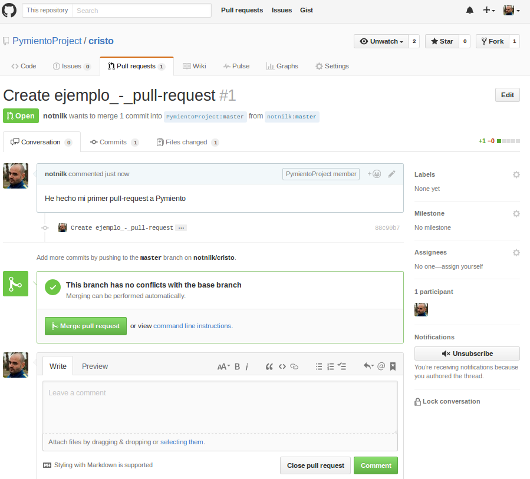

# Pull-Request - Subir cambios

Una vez tengamos todos los cambios subidos en el repositorio copia de nuestro Github, ahora que lo queda es mandarle nuestros cambios al dueño del repositorio. Para ello tenemos un botón arriba a la izquierda que pone _"New pull request"_

Si le damos nos saldrá el menu para empezar esta operación. Podremos ver toda la información del repositorio y los cambios que hemos hecho. En mi caso solo he añadido un fichero y he dejado el mensaje _"Mi primer pull-request"_ en la subida a mi repositorio de Github.

Al darle a _"Create pull request"_ se expande el menu y tendremos más opciones para el _pull request_, como por ejemplo modificar el mensaje para el destinatario de la subida.

Al darle al botón _"Create pull request"_ se mandará por fin la subida al repositorio original. Ahora el creador del repositorio original será el que decida si acepta esos cambios o no. En la pantalla que se abre se podrá ver todo esto, e incluso poder intercambiar mensajes sobre la operación.

En el siguiente apartado podemos ver como aceptar cambios de otros.