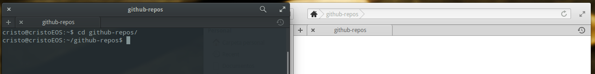

# Repositorio propio

Supongamos que ya tenemos nuestra cuenta de Github creada y configurada. Vamos a ver como trabajar con nuestros propios repositorios.


## 2) Hacer una copia local 
El siguiente paso para trabajar con el repo de Github es hacerse una copia en tu ordenador para poder manipularlo. Para ello veremos que hay un botón que pone _"Clone or download"_ al darle, saldrá una url, que en mi caso es ```https://github.com/notnilk/repo-ejemplo.git```, y la copio.
Ahora creo una carpeta en mi equipo para poder tener el repo. En mi caso en mi directorio principal he creado la carpeta _"github-repos"_


Ahora abro una terminal y me pongo dentro de esta carpeta. Para ello en Linux uso el comando 

```cd <nombre_carpeta>```


Ahora mediante el comando _"git"_ clonamos el repositorio en esa carpeta. La sentencia a introducir es _"git clone <url del repo>"_ así que en mi caso queda como 

```git clone https://github.com/notnilk/repo-ejemplo.git```

Le damos a _"enter"_ y nos copiará el archivo en local


