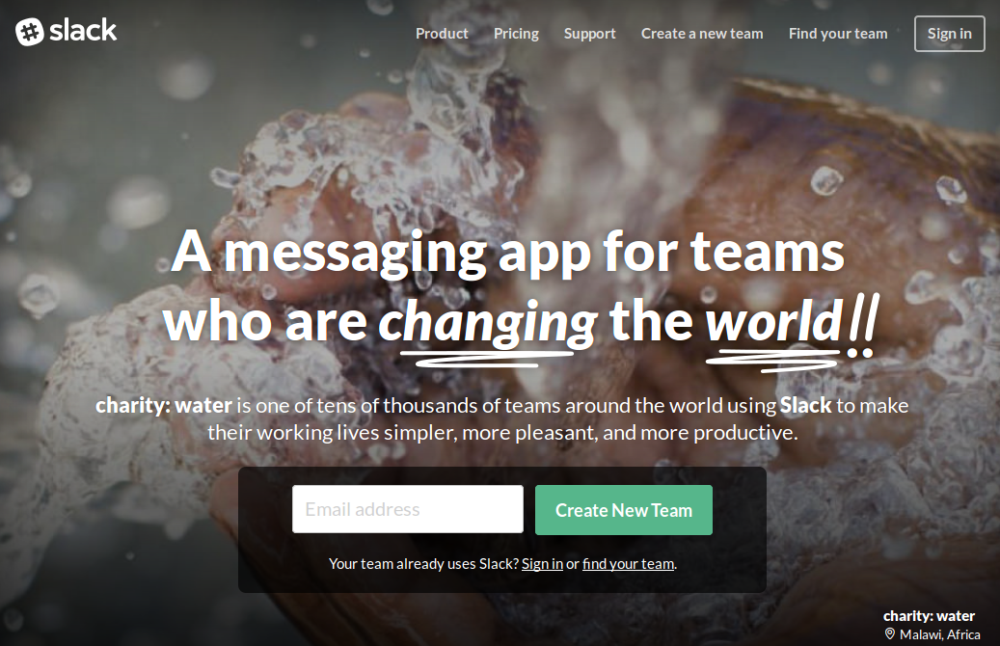
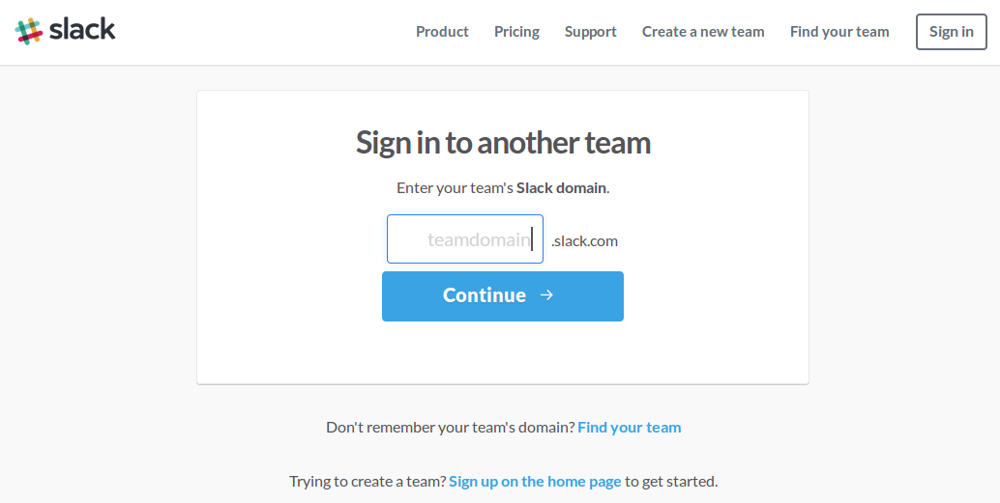
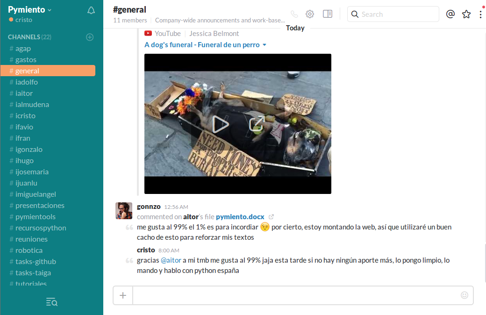

# Slack

Slack es una herramienta de comunicación para equipos, es decir, un whatsapp para poder gestionar equipos. Es similar a los antiguos chats IRC, pero presenta una interfaz amigable, bonita.

Podemos usar Slack desde:
* [Página web](https://slack.com/)
* [Aplicación para ordenador / móvil](https://slack.com/downloads)

### Primeros pasos
Os habrá llegado una invitación al correo para ser miembros de el canal / dominio de Slack Pymiento. Es importante que no la perdáis porque no se puede reenviar. Sea como fuere, vamos a la página principal de Slack y le damos a _"Sign in"_ (suele estar arriba a la derecha).

Una vez dentro pedirá el _"teamdomain"_, es el nombre del grupo, así que poned _"pymiento"_. Luego os pedirá vuestro email (_domain_), contraseña (_password_) y puede que nombre de usuario (de esto no estoy seguro). La contraseña no es obligatoria en principio, pero si os da problemas, poned _"pimientosverdesfritos"_.

Una vez dentro tendréis un menú de este estilo

En la barra lateral izquierda tenéis el nombre del grupo, _Pymiento_ en este caso, y un botón de opciones. Más abajo están los canales, que son distintos hilos de conversación, y después los usuarios (para poder hablar en privado).

Se han creado y se crean distintos canales para poder tener categorizadas las conversaciones. Ejemplo de estos son:
* _**tasks-github / tasks-taiga**_ Donde se ve un registro de las tareas en las diferentes herramientas que usamos.
* _**inombre**_ Aquí aparecen las _ideas_ de la persona que tiene ese nombre, es decir, ialmudena es el canal donde Almudena tiene que ir poniendo todas las ideas, recursos y sugerencias que se le ocurran sobre su aportación a Pymiento.
* etc...

Slack permite millones de cosas como: integración con otras herramientas, plugins, poder _reaccionar / valorar_ comentarios, subir archivos, etc. Es potentísima y bellísima. La mejor manera de aprender a usarla es usándola, así que... ¿A que esperas?
