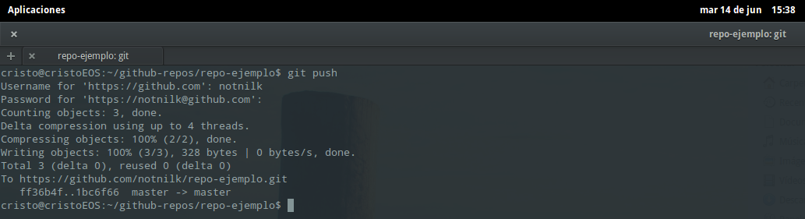

# Subir cambios a Github
Para subir nuestros cambios a nuestro repositorio en Github es ya solo un soplido. Solo hay que usar un comando, _git push_
```
git push <url del repositorio>
```
Si hemos seguido la guía, en nuestro carpeta _.git_ está contenida toda la información del repositorio, incluida la url del repositorio. Si, es ese nuestro caso, no hace ni siquiera poner la url, con poner solo
```
git push
```
Ya haría la subida. Ahora por terminal nos pedirá nuestra cuenta de _user_ Github y el _password_ (mientras se introduce la contraseña parece que no se está escribiendo nada, pero si se está escribiendo aunque no se vea, así que tranquil@).



Si ahora vamos a nuestro Github podremos comprobar como la subida se ha hecho satisfactoriamente


