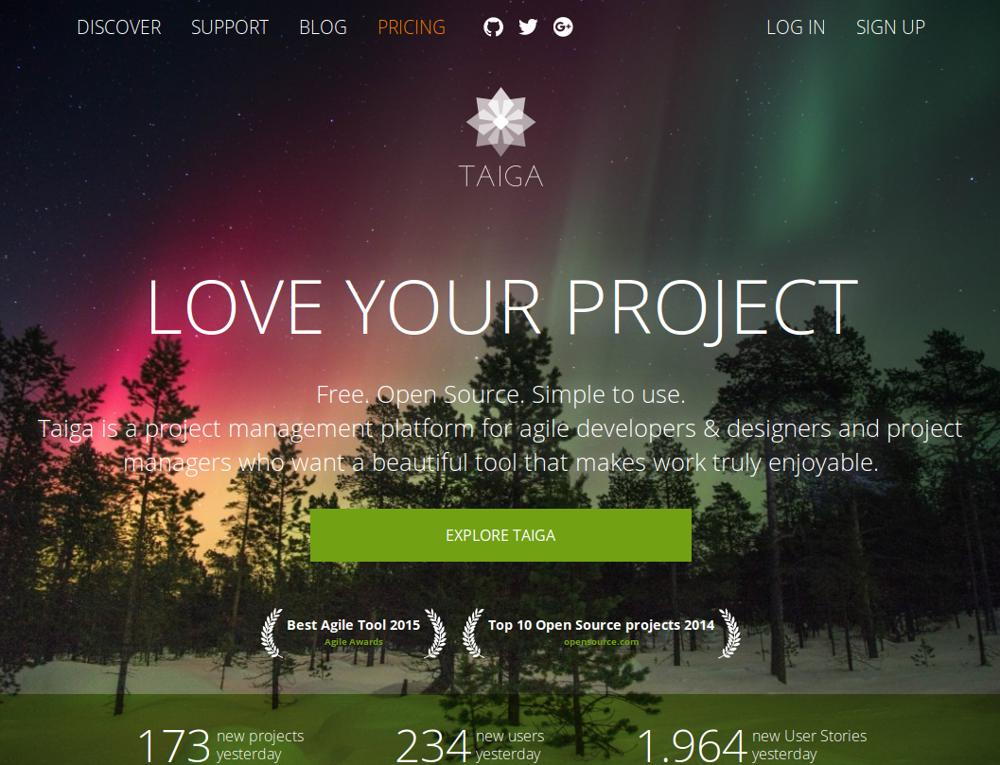
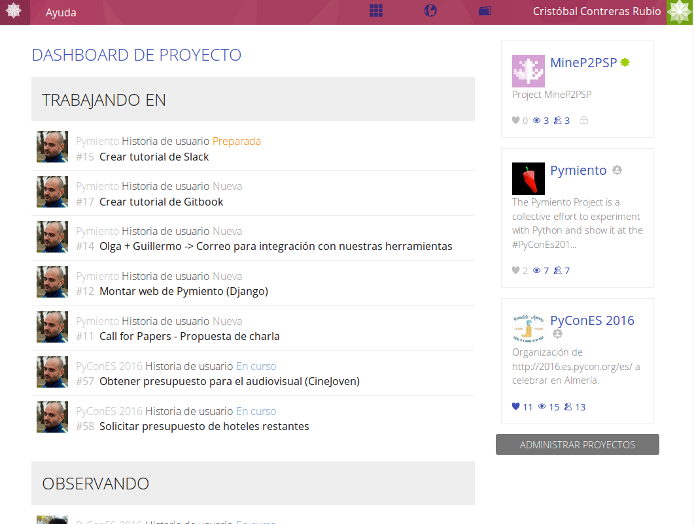
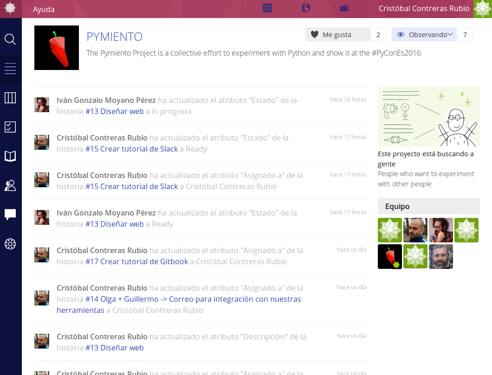
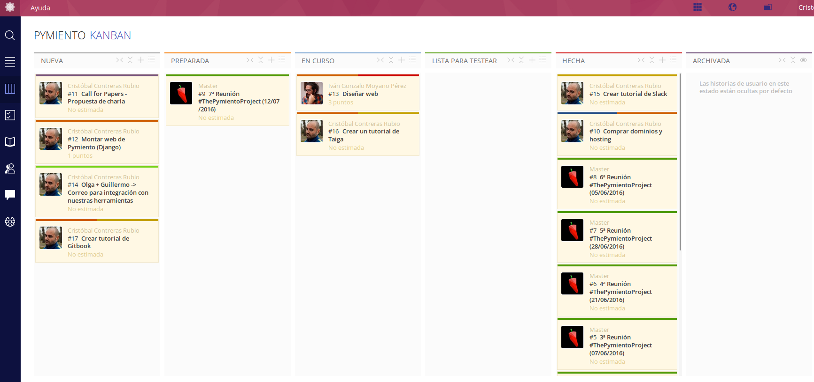

# Taiga

[Taiga.io](https://taiga.io/) es un gestor de proyectos Open Source, que permite llevar control de tareas, documentación, reuniones, etc. Es un software español (de una startup española), premiado como [uno de los mejores 10 proyecto de software libre de 2014](https://opensource.com/business/14/12/top-10-open-source-projects-2014), y como [mejor herramienta ágil de gestión de 2015](https://blog.taiga.io/you-helped-us-win-the-best-agile-tool-2015-award.html). Tiene una interfaz preciosa que dan ganas de usar.

**NOTA**: A la hora de escribir estas líneas, la herramienta no tiene manual de uso como tal. Puede deberse a que al ser un producto español, la hora de desarrollar este es en la hora de la siesta

Al igual que en Slack, habréis recibido una invitación por correo para daros de alta / participar en Taiga, no la puedo reenviar así que por favor, buscadla y dadle al enlace que os viene.

